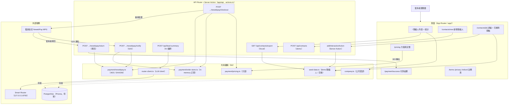
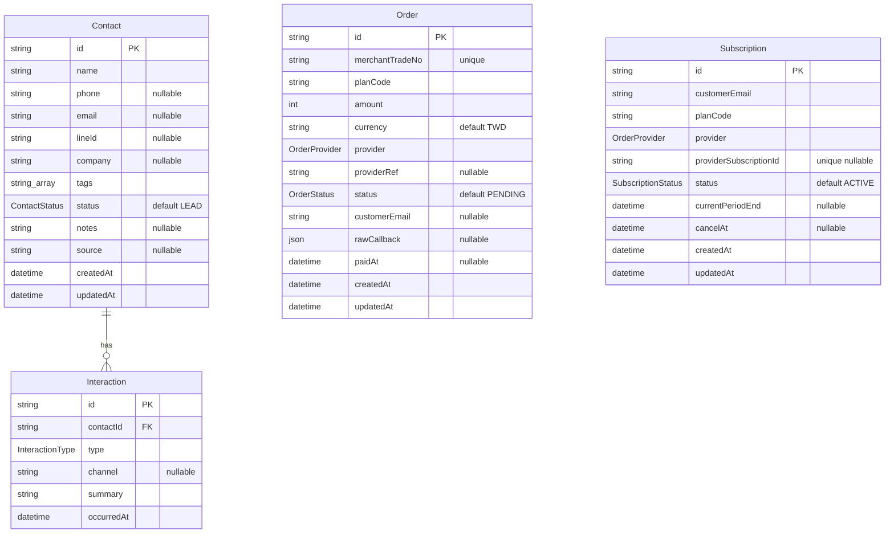

# 架構說明（ARCHITECTURE）

> TinyCRM TW — 為台灣中小型業務量身打造的迷你 CRM。手機優先、LINE 備註、一鍵匯出 Excel，內建藍新金流（NewebPay）訂閱付款與透過 Smart Router 的 AI 業務筆記摘要。

## 專案總覽

TinyCRM TW 是一套基於 **Next.js 16 App Router** 的單一 Web 應用，鎖定業務、房仲、保險、接案者與教育招生等需要隨手記錄客戶與跟進的場景。整個專案同時包含：

- **前端頁面**（聯絡人列表 / 新增 / 詳細頁＋互動時間軸、定價、付款結果、法務頁）。
- **後端 API Route**（新增聯絡人、Excel 匯出、AI 筆記摘要、藍新金流 checkout / notify / return）。
- **Server Action**（在詳細頁新增互動）。

### 目前資料層狀態（重要）

實際程式碼為「**demo 模式優先**」設計，方便在未連接資料庫前直接試用：

- 列表 / 詳細 / 匯出讀取的是 `lib/seed-data.ts` 內建的種子資料（`seedContacts` / `seedInteractions`）。
- `POST /api/contacts` 僅驗證後回傳 `{ ok: true, demo: true }`，**尚未寫入資料庫**（程式碼內標註 `TODO: persist via Prisma`）。
- 在詳細頁新增互動（`addInteractionAction`）是以 `appendInteraction` **推入記憶體陣列**，非持久化；伺服器重啟即失效。
- 訂單與訂閱以 in-memory store（`lib/payment/order-store.ts`，掛在 `globalThis`）暫存。
- Prisma schema（`Contact` / `Interaction` / `Order` / `Subscription`）已備妥，待設定 `DATABASE_URL` 並執行 `prisma db push` 後，再將上述 store / seed 切換為 Prisma Client。

## 技術棧

下表技術自 `package.json` 相依套件與設定檔實際抓取。

| 類別 | 技術 / 套件 | 版本 |
| --- | --- | --- |
| 框架 | Next.js（App Router） | `16.2.4` |
| UI Runtime | React / React DOM | `19.2.4` |
| 語言 | TypeScript | `^5` |
| 樣式 | Tailwind CSS v4（`@tailwindcss/postcss`） | `^4` |
| 圖示 | `lucide-react` | `^1.14.0` |
| UI 工具 | `class-variance-authority` / `clsx` / `tailwind-merge` | `^0.7.1` / `^2.1.1` / `^3.5.0` |
| ORM | Prisma（`prisma` + `@prisma/client`） | `^6.19.3` |
| 資料庫 | PostgreSQL（datasource provider `postgresql`） | — |
| Excel 匯出 | `xlsx`（SheetJS） | `^0.18.5` |
| 金流 | 藍新金流 NewebPay MPG（以 Node 內建 `node:crypto` 實作，無額外 SDK） | — |
| AI | 本機 Smart Router（OpenAI 相容 `/v1/chat/completions`，`lib/router-client.ts`） | — |
| Lint | ESLint + `eslint-config-next` | `^9` / `16.2.4` |
| 字體 | `next/font/google`（Geist / Geist Mono） | — |

## 架構圖



## 資料模型（Prisma `erDiagram`）

> 來源：`prisma/schema.prisma`。目前為「已定義、待接線」狀態：執行時資料實際來自 seed / in-memory store。`Order` 與 `Subscription` 無外鍵關聯，僅以 `customerEmail` / `planCode` 弱關聯。



**列舉（enum）：**

- `ContactStatus`：`LEAD` / `QUALIFIED` / `CUSTOMER` / `CHURNED`
- `InteractionType`：`CALL` / `MESSAGE` / `MEETING` / `NOTE` / `EMAIL` / `LINE`
- `OrderProvider`：`NEWEBPAY`
- `OrderStatus`：`PENDING` / `PAID` / `FAILED` / `REFUNDED`
- `SubscriptionStatus`：`ACTIVE` / `PAST_DUE` / `CANCELED` / `EXPIRED`

## 重要目錄結構

```
.
├── app/                              # Next.js App Router
│   ├── layout.tsx                    # 根 layout（字體、metadata、全站 footer 法務連結）
│   ├── page.tsx                      # 首頁：聯絡人列表 + 4 張統計卡（讀 seed-data）
│   ├── globals.css                   # Tailwind v4 全域樣式
│   ├── contacts/
│   │   ├── new/page.tsx              # 新增聯絡人表單（client，fetch POST /api/contacts）
│   │   └── [id]/
│   │       ├── page.tsx              # 詳細頁 + 互動時間軸（server component）
│   │       ├── InteractionForm.tsx   # 新增互動表單（client，useActionState）
│   │       └── actions.ts            # addInteractionAction（Server Action）
│   ├── pricing/page.tsx              # 方案與定價（讀 TINYCRM_PLANS）
│   ├── payment/success/page.tsx      # 付款結果頁（讀 query：order / status）
│   ├── terms/page.tsx                # 服務條款
│   ├── privacy/page.tsx              # 隱私權政策（個資法第 8 條告知）
│   ├── refund/page.tsx               # 退款政策
│   └── api/
│       ├── contacts/
│       │   ├── route.ts              # POST 新增聯絡人（demo，未寫 DB）
│       │   └── export/route.ts       # GET 匯出 Excel（xlsx）
│       ├── lead-summary/route.ts     # POST AI 業務筆記摘要（Smart Router）
│       └── payment/newebpay/
│           ├── checkout/route.ts     # POST 建立訂單 + MPG 加密參數
│           ├── notify/route.ts       # POST S2S 付款通知（固定回 "0"）
│           └── return/route.ts       # POST 使用者導回 → 303 轉址結果頁
├── lib/
│   ├── company.ts                    # 公司資訊單一來源（名稱 / 統編 / 地址 / Email）
│   ├── seed-data.ts                  # demo 聯絡人 / 互動 + helper（append / query）
│   ├── utils.ts                      # cn() + 狀態中文標籤 / 徽章樣式
│   ├── router-client.ts              # Smart Router LLM client（chat()）
│   └── payment/
│       ├── pricing.ts                # 方案定價（basic / pro）
│       ├── order-store.ts            # in-memory 訂單儲存（鏡像 Prisma Order）
│       └── newebpay.ts               # MPG 加解密 / TradeSha / buildCheckoutPayload
├── prisma/
│   └── schema.prisma                 # Contact / Interaction / Order / Subscription
├── public/                           # 靜態資源（預設 Next.js SVG）
├── .env.example                      # 環境變數範例
├── next.config.ts                    # Next.js 設定（目前為空白預設）
├── eslint.config.mjs                 # ESLint flat config
├── postcss.config.mjs                # PostCSS（@tailwindcss/postcss）
├── tsconfig.json                     # 路徑別名 @/* → ./
└── package.json
```

## 設計重點

- **單一來源**：公司資訊集中於 `lib/company.ts`，方案集中於 `lib/payment/pricing.ts`，全站引用。
- **金流自實作**：藍新 MPG 的 AES-256-CBC 加解密與 SHA256 TradeSha 全用 Node `node:crypto` 手寫（`lib/payment/newebpay.ts`），無第三方 SDK；TradeSha 格式為 `HashKey={KEY}&{HEX}&HashIV={IV}`，加密 hex **不加 `TradeInfo=` 前綴**。
- **AI 走免費層**：`/api/lead-summary` 透過 Smart Router 以 `tier: "free"` 呼叫 LLM，避免消耗付費額度；失敗回 `502`。
- **金流路由標註**：checkout / notify / return 皆宣告 `runtime = "nodejs"` 與 `dynamic = "force-dynamic"`。
