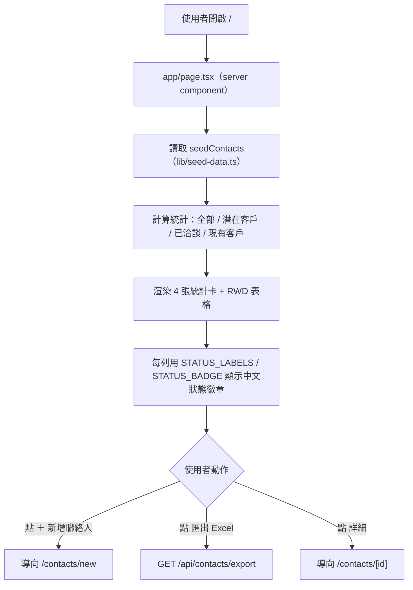
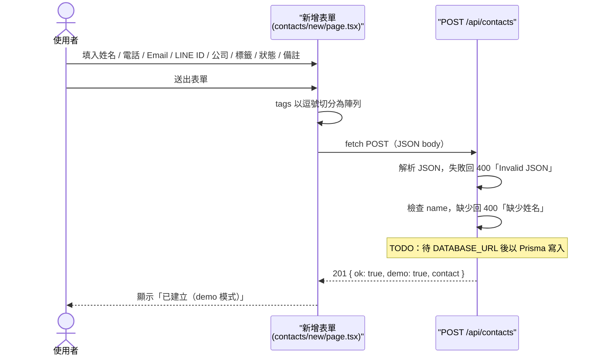
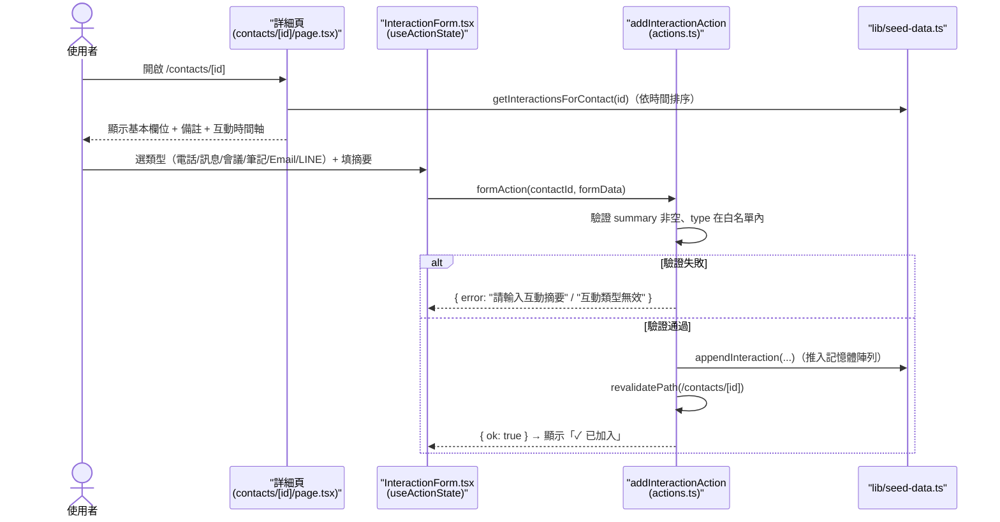
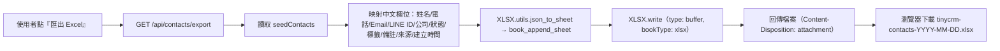
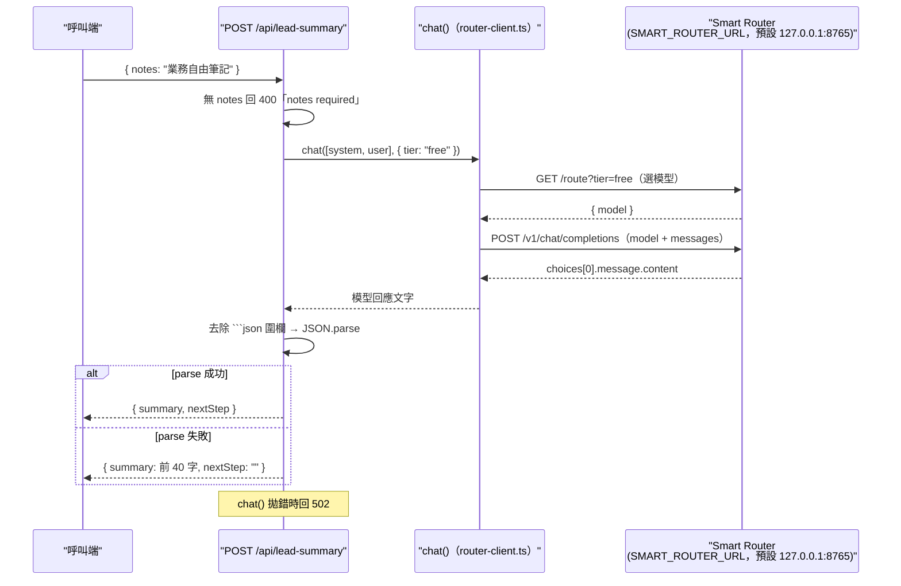
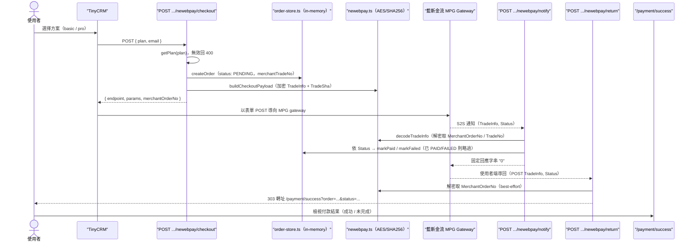

# 關鍵流程（FLOWS）

> 以下流程之節點均對應 repo 內真實的頁面、API Route、Server Action 與函式。各流程旁標註對應檔案。

## 1. 瀏覽聯絡人列表與統計（首頁）

對應：`app/page.tsx`、`lib/seed-data.ts`、`lib/utils.ts`

**說明：** 首頁為 server component，資料目前直接來自 `seedContacts`（demo 種子）。狀態以中文徽章顯示（潛在客戶 / 已洽談 / 現有客戶 / 流失），對應 enum `LEAD / QUALIFIED / CUSTOMER / CHURNED`。

---

## 2. 新增聯絡人（demo 模式）

對應：`app/contacts/new/page.tsx`、`app/api/contacts/route.ts`

**說明：** 表單為 client component。後端目前**不寫入資料庫**，僅驗證姓名後回 `201` 並標 `demo: true`；真正持久化待 Prisma 接線後補上。

---

## 3. 新增互動紀錄（互動時間軸，Server Action）

對應：`app/contacts/[id]/page.tsx`、`InteractionForm.tsx`、`actions.ts`、`lib/seed-data.ts`

**說明：** 透過 React `useActionState` 串接 Server Action。新增的互動以 `appendInteraction` 推入 `seedInteractions` 記憶體陣列（非持久化，伺服器重啟即失效），並用 `revalidatePath` 重新渲染時間軸。

---

## 4. 匯出聯絡人 Excel

對應：`app/api/contacts/export/route.ts`、`lib/seed-data.ts`、`xlsx`

**說明：** 使用 SheetJS（`xlsx`）即時產生 `.xlsx`。狀態欄以 `STATUS_LABELS` 轉中文，標籤以「、」串接，檔名帶當日日期。

---

## 5. AI 業務筆記摘要

對應：`app/api/lead-summary/route.ts`、`lib/router-client.ts`、Smart Router

**說明：** 系統提示要求模型輸出 `{"summary","nextStep"}` JSON（繁中、字數上限）。走 Smart Router 免費層（`tier: "free"`），避免消耗付費額度；Router 端點異常時 API 回 `502`。

---

## 6. 藍新金流（NewebPay）訂閱付款

對應：`checkout/route.ts`、`notify/route.ts`、`return/route.ts`、`lib/payment/*`、`app/payment/success/page.tsx`

**說明：**

- **checkout**：依方案建立 in-memory 訂單（`PENDING`）並產生 MPG 加密參數（AES-256-CBC + SHA256 TradeSha）。
- **notify**：Server-to-server 權威狀態更新，依解密後 `Status === "SUCCESS"` 標記 `markPaid` 否則 `markFailed`，且具冪等保護（訂單已 `PAID`/`FAILED` 則不重複處理），**固定回應 `"0"`** 避免藍新重送風暴。
- **return**：僅作使用者端導回，best-effort 解出訂單編號後 **303 轉址**至 `/payment/success`；狀態變更不在此處進行。
- **success**：依 query 參數 `order` / `status` 顯示「付款完成」或「付款未完成」與客服資訊。
